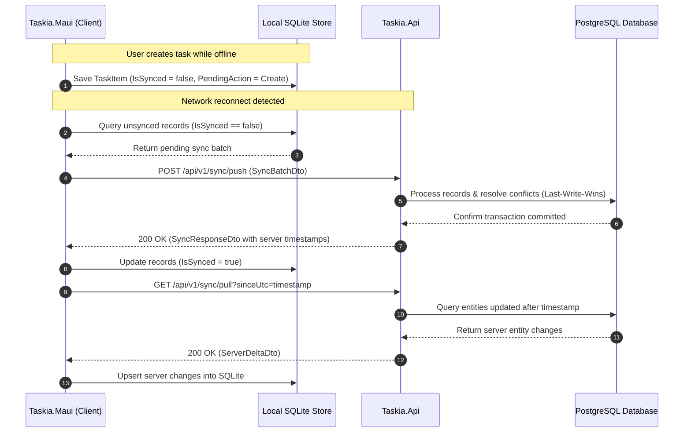

# Taskia — Sequence Diagrams

## Offline Sync Sequence Diagram

```mermaid
sequenceDiagram
    autonumber
    participant App as Taskia.Maui (Client)
    participant SQLite as Local SQLite Store
    participant API as Taskia.Api
    participant DB as PostgreSQL Database

    Note over App,SQLite: User creates task while offline
    App->>SQLite: Save TaskItem (IsSynced = false, PendingAction = Create)
    
    Note over App,API: Network reconnect detected
    App->>SQLite: Query unsynced records (IsSynced == false)
    SQLite-->>App: Return pending sync batch
    
    App->>API: POST /api/v1/sync/push (SyncBatchDto)
    API->>DB: Process records & resolve conflicts (Last-Write-Wins)
    DB-->>API: Confirm transaction committed
    API-->>App: 200 OK (SyncResponseDto with server timestamps)
    
    App->>SQLite: Update records (IsSynced = true)
    
    App->>API: GET /api/v1/sync/pull?sinceUtc=timestamp
    API->>DB: Query entities updated after timestamp
    DB-->>API: Return server entity changes
    API-->>App: 200 OK (ServerDeltaDto)
    App->>SQLite: Upsert server changes into SQLite
```
